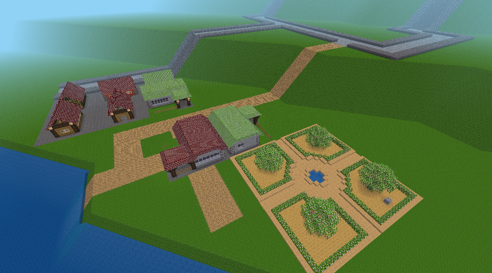

# Eco

A game for minetest

Proof of concept Simutrans/SimCity/Network$A4 clone

State: **WIP**

Discord: https://discord.gg/fECUHdu

# TODO

* [ ] initial items on first join (placement wand)
* [ ] Money display on hud
* [ ] Influence stats on hud
* [ ] Money entity +/- on placement
* [ ] "Destroy building" wand
* [ ] Building upgrades (depending on influence)
* [ ] Tax income
* [ ] More buildings
* [ ] Town center and name display on hud
* [ ] Transportation concept (carts/rails?)

## Far away

* [ ] Proper logo
* [ ] ContentDB (https://content.minetest.net/help/package_config/)

# Development

Mod docs:

* [eco_grid](./mods/eco_grid/readme.md) per mapblock data storage
* [eco_mapgen](./mods/eco_mapgen/readme.md) map generation
* [eco_placement](./mods/eco_placement/readme.md) placement functions
* [eco_serialize](./mods/eco_serialize/readme.md) serialization commands and functions

# Licenses

## Code

* MIT

## Assets

* `mods/default` CC BY-SA 3.0 / LGPL 2.1 https://github.com/minetest/minetest_game

* 16x16 Icons in `mods/eco_placement/textures/*`
  * CC BY-SA 3.0 http://www.small-icons.com/packs/16x16-free-toolbar-icons.htm
  * CC BY-SA 3.0 http://www.small-icons.com/packs/16x16-free-application-icons.htm
